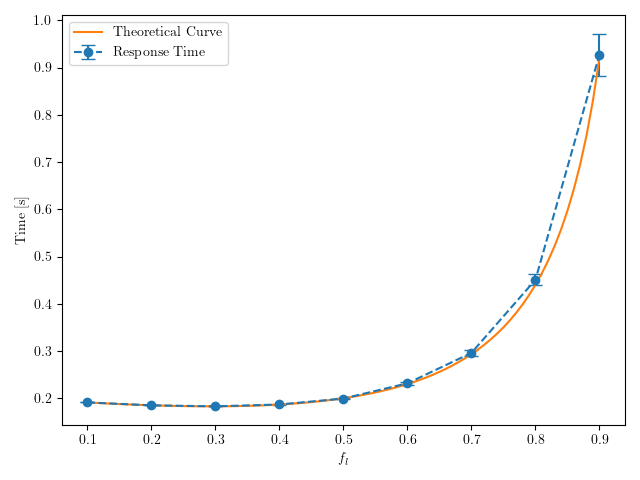

# 16 Gennaio 2024

---

## Parte 1

`update_template.py`

`make_runfile.py -f esame240116.ini`

`make -j $(nproc) -f Runfile`

`parse_data.py -c config240116.json -d esame240116.db -r results/esame240116_fl*.sca`

`analyze_data.py -d esame240116.db -c config240116.json`

`LANG=C gnumeric results/parte1_esame240116.data`

| $f_l$ | ResponseTime | sigma(ResponseTime) |
| --- | --- | --- |
| 0.7 | 0.29585281034768 | 0.006266995495151374 |

---

## Parte 2

- $\lambda$ = 10 req/s
- $\mu$ = 10 req/s (locale)
- $\delta_c$ = 0.1s (ritardo rete cloud)
- $T_c$ = $\frac{1}{\mu}$ = 0.1s (esecuzione cloud)

```
T_local = 1/(μ - λ·f_l)
T_cloud = δ_c + T_c = 0.1 + 0.1 = 0.2s (fisso!)
```

**Obiettivo**: Trovare $f_l$ tale che $T_{local} = T_{cloud}$

**Imposta $T_{local} = T_{cloud}$:**
```
1/(μ - λ·f_l) = 0.2

1/(10 - 10·f_l) = 0.2

10 - 10·f_l = 1/0.2

10 - 10·f_l = 5

10·f_l = 5

f_l = 0.5
```

**Ramo Local:**
```
λ_l = 10 × 0.5 = 5 req/s
T_local = 1/(10 - 5) = 1/5 = 0.2s ✓
```

**Ramo Cloud:**
```
λ_c = 10 × 0.5 = 5 req/s
T_cloud = δ_c + T_c = 0.1 + 0.1 = 0.2s (corretto)
```

**T_local = T_cloud = 0.2s** ✓


| $f_l$ | $T_{local}$ | $T_{cloud}$ |
|-------|-------------|-------------|
| 0.5   | 0.2s        | 0.2s        |

**Soluzione: $f_l = 0.5$**

---
# Parte 3

`update_template.py`

`make_runfile.py -f esame240116_p3.ini`

`make -j $(nproc) -f Runfile`

`parse_data.py -c config240116_p3.json -d esame240116_p3.db -r results/esame240116_p3_fl*.sca`

`analyze_data.py -d esame240116_p3.db -c config240116_p3.json`

`LANG=C gnumeric results/parte3_esame240116.data`

| $f_l$ | ResponseTime | sigma(ResponseTime) |
| --- | --- | --- |
| 0.1 | 0.191129328943408 | 0.00017632295369353763 |
| 0.2 | 0.18491163277713402 | 0.00018524132614876327 |
| 0.3 | 0.182789214968 | 0.0003009778161031828 |
| 0.4 | 0.18669939357460003 | 0.0006313610695792868 |
| 0.5 | 0.19926125797104002 | 0.0013009893349849363 |
| 0.6 | 0.23152715451024597 | 0.002914980100246692 |
| 0.7 | 0.29585281034768 | 0.006266995495151374 |
| 0.8 | 0.45069622859985403 | 0.011957344636338432 |
| 0.9 | 0.9274400358848119 | 0.044546746417730765 |

---
# Parte 4
Prima di plottare eliminare l'hashtag # all’inizio del file *parte3_esame240116.data*

`python3 plot_esame240116.py`



---