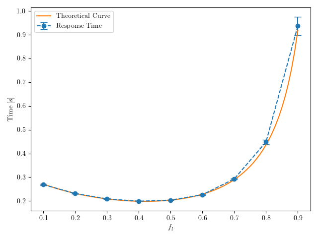

# 10 Settembre 2024

---

## Parte 1

`update_template.py`

`make_runfile.py -f esame240910.ini`

`make -j $(nproc) -f Runfile`

`parse_data.py -c config240910.json -d esame240910.db -r results/esame240910_fl*.sca`

`analyze_data.py -d esame240910.db -c config240910.json`

`LANG=C gnumeric results/parte1_esame240910.data`

| $f_l$ | ResponseTime | sigma(ResponseTime) |
| --- | --- | --- |
| 0.7 | 0.292982461568126 | 0.0025937992845352768 |

---

## Parte 2

- λ = 10 req/s
- μ = 10 req/s (locale)
- μ_net = 1/0.07 = 14.286 req/s (server rete)
- T_c = 1/μ = 0.1s (esecuzione cloud)

```
T_local = 1/(μ - λ·f_l)
T_cloud = T_network + T_c
T_network = 1/(μ_net - λ·(1-f_l)) [M/M/1!]
```

**Obiettivo**: Trovare $f_l$ tale che $T_{local} = T_{cloud}$

**Imposta $T_{local} = T_{cloud}$:**
```
1/(10 - 10·f_l) = 1/(14.286 - 10(1-f_l)) + 0.1

1/(10 - 10·f_l) = 1/(14.286 - 10 + 10·f_l) + 0.1

1/(10 - 10·f_l) = 1/(4.286 + 10·f_l) + 0.1

1/(10 - 10·f_l) - 0.1 = 1/(4.286 + 10·f_l)

[1 - 0.1(10 - 10·f_l)]/(10 - 10·f_l) = 1/(4.286 + 10·f_l)

[1 - 1 + f_l]/(10 - 10·f_l) = 1/(4.286 + 10·f_l)

f_l/(10 - 10·f_l) = 1/(4.286 + 10·f_l)

f_l(4.286 + 10·f_l) = 10 - 10·f_l

4.286·f_l + 10·f_l² = 10 - 10·f_l

10·f_l² + 14.286·f_l - 10 = 0

Dividi per 10:
f_l² + 1.4286·f_l - 1 = 0
```

```
f_l = [-1.4286 ± √(1.4286² + 4)]/2
f_l = [-1.4286 ± √6.04]/2
f_l = [-1.4286 ± 2.458]/2

f_l = 0.515
```

| $f_l$ | $T_{local}$ | $T_{cloud}$ |
|-------|-------------|-------------|
| 0.52  | 0.208s      | 0.205s      |

**Soluzione: $f_l \approx 0.515$**

---

## Parte 3

`update_template.py`

`make_runfile.py -f esame240910_p3.ini`

`make -j $(nproc) -f Runfile`

`parse_data.py -c config240910_p3.json -d esame240910_p3.db -r results/esame240910_p3_fl*.sca`

`analyze_data.py -d esame240910_p3.db -c config240910_p3.json`

`LANG=C gnumeric results/parte3_esame240116.data`

| $f_l$ | ResponseTime | sigma(ResponseTime) |
| --- | --- | --- |
| 0.1 | 0.268832802322516 | 0.002681677680866952 |
| 0.2 | 0.231675932316264 | 0.0011843227653485471 |
| 0.3 | 0.209168302917398 | 0.0014519169579263014 |
| 0.4 | 0.19914905275155598 | 0.0013157192474004885 |
| 0.5 | 0.20383827422102999 | 0.0017272134177641811 |
| 0.6 | 0.226643798474226 | 0.0017846477337687895 |
| 0.7 | 0.292982461568126 | 0.0025937992845352768 |
| 0.8 | 0.448553480939012 | 0.009228446103954855 |
| 0.9 | 0.936568573361266 | 0.03867826342191397 |

---

## Parte 4

Prima di plottare eliminare l'hashtag # all’inizio del file *parte3_esame240910.data*

`python3 plot_esame240910.py`



---