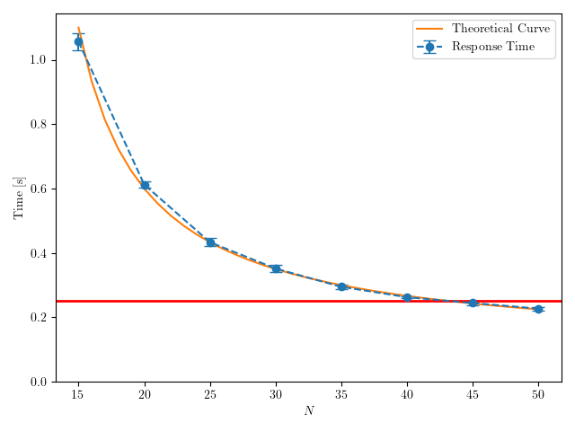

# 20 Febbraio 2025

---

## Parte 1

`update_template.py`

`make_runfile.py -f esame250220.ini`

`make -j $(nproc) -f Runfile`

`parse_data.py -c config250220.json -d esame250220.db -r results/esame250220_N20*.sca`

`analyze_data.py -d esame250220.db -c config250220.json`

`LANG=C gnumeric results/parte1_esame250220.data`

| $N$ | ResponseTime | sigma(ResponseTime) |
| --- | --- | --- |
| 20 | 0.612440406197868 | 0.010004056759466822 |

---

## Parte 2

- λ = 100 req/s
- μ = 10 req/s (per server)
- cv = 3 (lognormal)
- SLA: T_r < 0.25s

```
T_r = (1/μ) · [1 + (ρ/(1-ρ)) · ((1 + cv_s²)/2)]
T_r = 0.1 · [1 + 5ρ/(1-ρ)]
dove ρ = λ/(N·μ) = 100/(10N) = 10/N
```

**Obiettivo**: Trovare $N$ minimo per $T_r \leq 0.25s$

**Imposta $T_r \leq 0.25$:**
```
0.1 · [1 + 5ρ/(1-ρ)] ≤ 0.25

1 + 5ρ/(1-ρ) ≤ 2.5

5ρ/(1-ρ) ≤ 1.5

5ρ ≤ 1.5(1-ρ)

5ρ ≤ 1.5 - 1.5ρ

6.5ρ ≤ 1.5

ρ ≤ 0.231
```

**Ricava N:**
```
10/N ≤ 0.231

N ≥ 10/0.231

N ≥ 43.3

N = 44 server ✓
```

**Verifica N=44**

```
ρ = 10/44 = 0.227

T_r = 0.1 · [1 + 5·0.227/(1-0.227)]
T_r = 0.1 · [1 + 1.135/0.773]
T_r = 0.1 · 2.47
T_r = 0.247s < 0.25s ✓
```

| N  | T_r   |
|----|-------|
| 44 | 0.247s|

**Soluzione: N = 44 server**

---

## Parte 3

`update_template.py`

`make_runfile.py -f esame250220_p3.ini`

`make -j $(nproc) -f Runfile`

`parse_data.py -c config250220_p3.json -d esame250220_p3.db -r results/esame250220_p3_N*.sca`

`analyze_data.py -d esame250220_p3.db -c config250220_p3.json`

`LANG=C gnumeric results/parte3_esame250220.data`

| $N$ | ResponseTime | sigma(ResponseTime) |
| --- | --- | --- |
| 15 | 1.0565165867087198 | 0.026911944107894832 |
| 20 | 0.612440406197868 | 0.010004056759466822 |
| 25 | 0.433359360189956 | 0.013098682740715966 |
| 30 | 0.3514507164091 | 0.011960978836031306 |
| 35 | 0.29478767590544597 | 0.0078015581150942615 |
| 40 | 0.262565621956376 | 0.0022215359865086484 |
| 45 | 0.24453386562753804 | 0.005840565939547491 |
| 50 | 0.226915760208828 | 0.005405820251285897 |

---

## Parte 4

Prima di plottare eliminare l'hashtag # all’inizio del file *parte3_esame250220.data*

`python3 plot_esame250220.py`



---