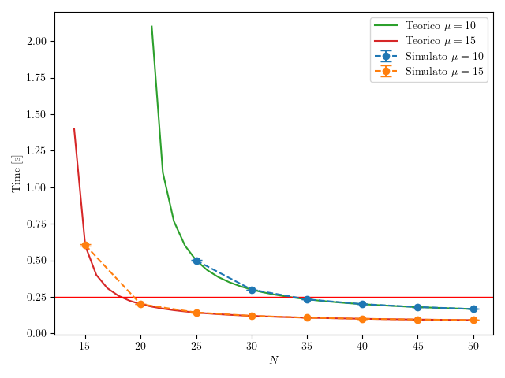

# 18 Giugno 2025

---

## Parte 1
`update_template.py`

`make_runfile.py -f esame250618.ini`

`make -j $(nproc) -f Runfile`

`parse_data.py -c config250618.json -d esame250618.db -r results/esame250618_N40*.sca`

`analyze_data.py -d esame250618.db -c config250618.json`

`LANG=C gnumeric results/parte1_esame250618.data`

| server_type | $N$ | ResponseTime | sigma(ResponseTime) |
| --- | --- | --- | --- |
| tipo1 | 40 | 0.200232591366106 | 0.0003637808434183234 |
| tipo2 | 40 | 0.099958596181952 | 0.00009116588844766866 |

---

## Parte 2

- λ = 200 req/s
- Tipo 1: μ=10, costo=1.5$/h
- Tipo 2: μ=15, costo=2.5$/h  
- SLA: T_r < 0.25s

**Formula M/M/1**
```
T_r = 1/(μ - λ/N) = N/(μN - λ)
```

**Tipo 1 (μ=10)**

```
N/(10N - 200) ≤ 0.25

N/(10N - 200) = 0.25
N = 0.25(10N - 200)
N = 2.5N - 50
1.5N = 50
N = 33.33 → 34 ✓
```
```
λ/server = 200/34 = 5.88
T_r = 1/(10-5.88) = 0.243s ✓
Costo = 34 × 1.5 = $51/h
```

**Tipo 2 (μ=15)**

```
N/(15N - 200) ≤ 0.25

N/(15N - 200) = 0.25
N = 0.25(15N - 200)
N = 3.75N - 50
2.75N = 50
N = 18.18 → 19 ✓
```
```
λ/server = 200/19 = 10.53
T_r = 1/(15-10.53) = 0.224s ✓
Costo = 19 × 2.5 = $47.5/h
```

**Risultati**

| Tipo | N  | T_r     | Costo   |
|------|----|---------|---------|
| 1    | 34 | 0.243s  | $51.0/h |
| 2    | 19 | 0.224s  | $47.5/h |

**Più conveniente: Tipo 2** (risparmio $3.5/h)

---

## Parte 3

`update_template.py`

`make_runfile.py -f esame250618_p3.ini`

`make -j $(nproc) -f Runfile`

`parse_data.py -c config250618_p3.json -d esame250618_p3.db -r results/esame250618_p3_N*.sca`

`analyze_data.py -d esame250618_p3.db -c config250618_p3.json`

`LANG=C gnumeric results/parte3_esame250618.data`

| server_type | $N$ | ResponseTime | sigma(ResponseTime) |
| --- | --- | --- | --- |
| tipo1 | 25 | 0.49903209637642193 | 0.003068160827635452 |
| tipo1 | 30 | 0.30004358562798805 | 0.0007137951323427682 |
| tipo1 | 35 | 0.233036758357526 | 0.0006508278825464939 |
| tipo1 | 40 | 0.200232591366106 | 0.0003637808434183234 |
| tipo1 | 45 | 0.18017752771749201 | 0.00018081711842250002 |
| tipo1 | 50 | 0.16662649818208 | 0.00013380391992771348 |
| tipo2 | 15 | 0.6042463429708561 | 0.00491844728992411 |
| tipo2 | 20 | 0.199756624850064 | 0.000553581885158762 |
| tipo2 | 25 | 0.14317017530318799 | 0.0001954250409016607 |
| tipo2 | 30 | 0.120258221742086 | 0.00017304659732834442 |
| tipo2 | 35 | 0.10766692105062 | 0.00019197353416600119 |
| tipo2 | 40 | 0.099958596181952 | 0.00009116588844766866 |
| tipo2 | 45 | 0.0946801368109974 | 0.00009867337516081037 |
| tipo2 | 50 | 0.09089526860055999 | 0.00008276166214851985 |

---

## Parte 4

Prima di plottare eliminare l'hashtag # all’inizio del file *parte3_esame250618.data*

`python3 plot_esame250618.py`



---