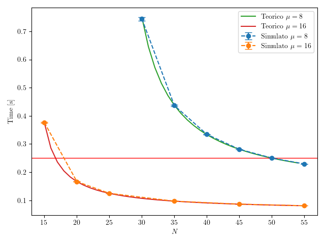

# 9 Settembre 2025

---

## Parte 1

`update_template.py`

`make_runfile.py -f esame250909.ini`

`make -j $(nproc) -f Runfile`

`parse_data.py -c config250909.json -d esame250909.db -r results/esame250909_N45*.sca`

`analyze_data.py -d esame250909.db -c config250909.json`

`LANG=C gnumeric results/parte1_esame250909.data`

| server_type | $N$ | ResponseTime | sigma(ResponseTime) |
| --- | --- | --- | --- |
| tipo1 | 45 | 0.28129832789756 | 0.0005139546075426404 |
| tipo2 | 45 | 0.0865882689008782 | 0.00008361391590475376 |

---

## Parte 2

- λ = 200 req/s
- Tipo 1: μ=8, costo=1.5$/h
- Tipo 2: μ=16, costo=3$/h  
- SLA: T_r < 0.25s

**Formula M/M/1**
```
T_r = 1/(μ - λ/N) = N/(μN - λ)
```
**Tipo 1 ($\mu$=8)**

```
N/(8N - 200) ≤ 0.25

N/(8N - 200) = 0.25
N = 0.25(8N - 200)
N = 2N - 50
N = 50
```
```
λ/server = 200/50 = 4
T_r = 1/(8-4) = 0.25s
Costo = 50 × 1.5 = $75/h
```

**Tipo 2 ($\mu$=16)**

```
N/(16N - 200) ≤ 0.25
N/(16N - 200) = 0.25
N = 0.25(16N - 200)
N = 4N - 50
3N = 50
N = 16.67 → 17
```
```
λ/server = 200/17 = 11.76
T_r = 1/(16-11.76) = 0.236s
Costo = 17 × 3 = $51/h
```

**Risultati**

| server_type | $N$  | $T_r$     | Costo   |
|------|----|---------|---------|
| tipo1    | 50 | 0.250s  | $75/h   |
| tipo2    | 17 | 0.236s  | $51/h   |

**Più conveniente: Tipo 2** (risparmio $24/h)

---

## Parte 3

`update_template.py`

`make_runfile.py -f esame250909_p3.ini`

`make -j $(nproc) -f Runfile`

`parse_data.py -c config250909_p3.json -d esame250909_p3.db -r results/esame250909_p3_N*.sca`

`analyze_data.py -d esame250909_p3.db -c config250909_p3.json`

`LANG=C gnumeric results/parte3_esame250909.data`

| server_type | $N$ | ResponseTime | sigma(ResponseTime) |
| --- | --- | --- | --- |
| tipo1 | 30 | 0.74432816804293 | 0.006490722440452235 |
| tipo1 | 35 | 0.436636161186924 | 0.001951511915185239 |
| tipo1 | 40 | 0.334295364881178 | 0.0015199576903499358 |
| tipo1 | 45 | 0.28129832789756 | 0.0005139546075426404 |
| tipo1 | 50 | 0.250178882443148 | 0.0005127627421732086 |
| tipo1 | 55 | 0.229402140944662 | 0.00039451348201409653 |
| tipo2 | 15 | 0.376243922144348 | 0.0017670355953550356 |
| tipo2 | 20 | 0.16669051890245798 | 0.000342939011742866 |
| tipo2 | 25 | 0.12497294168764399 | 0.00021522893436872438 |
| tipo2 | 35 | 0.0971220219049234 | 0.00008755422405338558 |
| tipo2 | 45 | 0.0865882689008782 | 0.00008361391590475376 |
| tipo2 | 55 | 0.08085360748157859 | 0.00008958727258874462 |

---

## Parte 4

Prima di plottare eliminare l'hashtag # all’inizio del file *parte3_esame250618.data*

`python3 plot_esame250909.py`



---